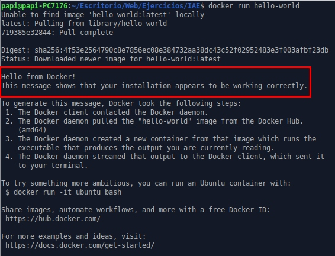
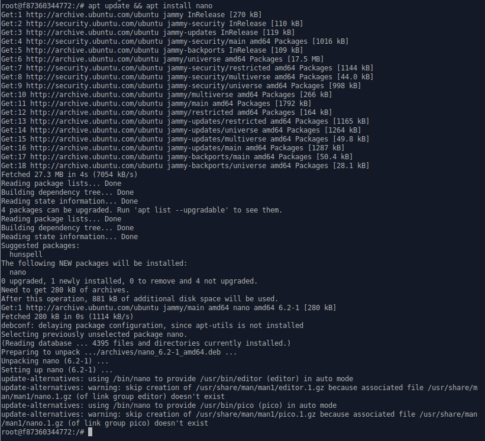

# Primeros pasos con Docker  
***
1. Ejecuta un contenedor a partir de la imagen **hello-world**.  
`$ docker run hello-world`  
- Comprueba que nos devuelve la salida adecuada.  
   
- Comprueba que no se está ejecutando.  
`$ docker ps`  
  
- Lista los contenedores que están parados.  
`$ docker ps -f "status=exited"`  
  
- Borra el contenedor.  
`$ docker rm fb17ea14f11f`  
    
2. Crea un contenedor interactivo desde una imagen **ubuntu**.  
`$ docker run -it --name miUbuntu ubuntu`  
  
- Instala un paquete (por ejemplo **nano**).  
`# apt update && apt install nano`    
  
- Sal de la terminal, ¿sigue el contenedor corriendo? ¿Por qué?.  
Si ejecutamos `# exit` en la terminal, se cerrará la sesión de la terminal dentro del contenedor y éste pasará al estado de detenido.
Si no queremos que esto ocurra, saldremos de la terminal con `Ctrl + P` seguido de `Ctrl + Q`  
- Vuelve a iniciar el contenedor de forma interactiva. ¿Sigue instalado el nano?.  
No falla:  
`$ docker start miUbuntu`  
`$ docker exec -it miUbuntu bash`  
Podría fallar:  
`$ docker start -ai miUbuntu` enlazará con la terminal del contenedor siempre y cuando el comando ejecutado al arranque del contenedor sea bash    
  
`# nano` y comprobamos que SÍ está instalado  
- Sal del contenedor, y bórralo.  
`# exit`  
`$ docker stop miUbuntu`  
`$ docker rm miUbuntu`  
  
- Crea un nuevo contenedor interactivo desde la misma imagen. ¿Tiene el nano instalado?  
`$ docker run -it --name miUbuntu2 ubuntu`  
 `# nano` y comprobamos que NO está instalado  
  
- Crea un contenedor demonio con un servidor **nginx**, usando la imagen oficial de nginx y redirigiendo al puerto 8080.  
`docker run --name miNginx -d -p 8080:80 nginx`  
- Al crear el contenedor, ¿has tenido que indicar algún comando para que lo ejecute?  
No
- Accede al navegador web y comprueba que el servidor esta funcionando.  
  
- Muestra los logs del contenedor.  
`$ docker logs miNginx`  
  
3. Crea un contenedor con la aplicación **Nextcloud**, mirando la documentación en docker Hub, para que el nombre de la base de datos sqlite que va a utilizar sea *dbSQLITE*.  
Para la persistencia de datos creo/utilizo el volumen *vNextcloud* y para el nombre de la base de datos utilizo la variable de entorno *SQLITE_DATABASE*  (para cositas de más embergadura ya está Dockerfile, Docker Compose, Kubernetes).  
```bash
$ docker run -d --name miNextcloud -p 8080:80 \
  -v vNextcloud:/var/www/html \
  -e SQLITE_DATABASE=dbSQLITE \
  nextcloud
  ```
  


