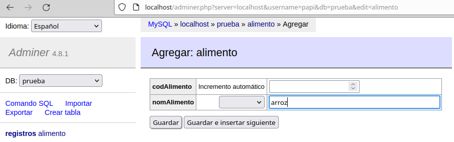
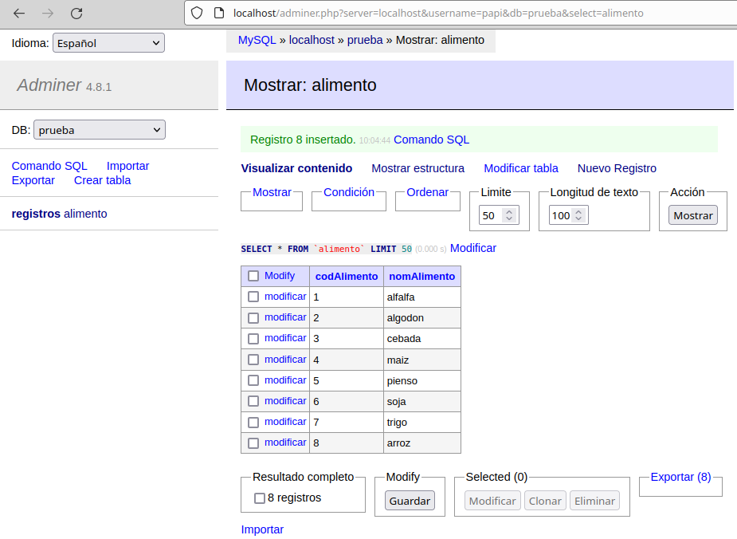

# LAMP en Ubuntu    
***
Instala la pila de aplicaciones LAMP en una máquina (Ubuntu) y configúralo para que se pueda acceder al servicio web funcionando con PHP y a la gestión de base de datos MySQL (PHPMyAdmin)  
Los pasos y entregas a seguir serán las siguientes:  

**1. Servidor Web Apache**  
- Instala el servidor Web Apache, configúralo y prueba que funciona correctamente.  
- Entrega la explicación de los pasos seguidos y una captura del navegador con la página de muestra de Apache en funcionamiento.  
`sudo apt update` para actualizar la lista de paquetes.  
`sudo apt install apache2` para instalar el servidor web Apache  
Como tengo la curiosidad de saber si el servicio inicia automáticamente con el arranque del equipo, voy a reiniciarlo y a comprobar el estado del servicio.  
`sudo systemctl status apache2` y comprobamos que el servicio ha iniciado automáticamente con el arranque del equipo, por lo que no tenemos que hacerle un `sudo systemctl enable apache2`  
  
`sudo netstat -tpan | grep apache2` y comprobamos que apache2 está escuchando por el puerto 80  ¿y no por el 443? Bueno, ya lo arreglaremos más adelante.   
  
Introducimos en el navegador web http://localhost y comprobamos que nos está sirviendo la página por defecto (/var/www/html/index.html):   
  
**Curturilla:**  
Tras la instalación, se crean los ficheros de configuración de Apache y se crea el usuario **www-data**, el cual es añadido al nuevo grupo **www-data**. Los procesos de Apache son ejecutados por este usuario.  
Además, se crea el directorio /var/www/html. Su propietario es **root**, su grupo es **root** y es el directorio raíz del servidor virtual por defecto.  
***
**2. MySql**  
- Instala el servidor MySql y configúralo.  
- Debes poder (por consola) acceder al servidor de base de datos, crear una base de datos de prueba con una tabla e insertar unos cuantos registros. Realiza una consulta para comprobar que se han insertado los registros.  
- Entrega la explicación de los pasos seguidos junto con capturas del proceso.  
`sudo apt update` para actualizar la lista de paquetes.  
`sudo apt install mysql-server` para instalar la base de datos MySql (al no indicarle versión instalará la última).  
Podéis creerme si os digo que MySql inicia automáticamente con el arranque del equipo.  
`sudo systemctl status mysql` y comprobamos que el servicio ha iniciado 
  
Recomendado: para no utilizar el usuario *root*, vamos a crear un usuario con todos los privilegios  
  ```bash 
  sudo mysql -u root  
  CREATE USER 'papi'@'localhost' IDENTIFIED BY '5291';  
  GRANT ALL PRIVILEGES ON *.* TO 'papi'@'localhost';  
  FLUSH PRIVILEGES;`  
  EXIT; 
  ```  
  Creamos la base de datos, tabla y datos con el nuevo usuario:  
  (para limpiar la pantalla en Oracle es `clear screen`; aquí lo haremos con `system clear`).  
  ```bash
  CREATE DATABASE prueba;  
  USE prueba;  
  CREATE TABLE alimento (    
    codAlimento int(11) AUTO_INCREMENT,   
    nomAlimento varchar(30) NOT NULL,  
    CONSTRAINT PK_alimentos	
    PRIMARY KEY (codAlimento)
  );  
  INSERT INTO alimento (nomAlimento) VALUES
    ('alfalfa'),  
    ('algodon'),  
    ('cebada'),  
    ('maiz'),  
    ('pienso'),  
    ('soja'),  
    ('trigo');  
  SELECT * FROM alimento;
  ```
    
***
**3. PHP**  
- Instala la última versión de PHP en tu máquina y muestra que está funcionando mostrando la información de PHP en una página web alojada en tu servicio web Apache.  
- Entrega la explicación de los pasos seguidos junto con capturas del proceso.  
`sudo apt install php php-mysql` para instalar el intérprete de PHP junto a paquetes adicionales como libapache2-mod-php (permite servir páginas PHP desde el servidor web Apache), y php-mysql (drivers MySQLi, MySQL PDO).  
`php -v` y comprobamos que nos ha instalado la última versión 8.1.2  
  
Creamos el archivo */var/www/html/info.php* con contenido:  
  ```
  <?php
    phpinfo();
  ?>
  ```
  Introducimos en el navegador web http://localhost/info.php y comprobamos que la página carga y nos muestra la información sobre PHP:  
    
- Crea otra página que muestre algunos datos de la base de datos anteriormente creada.  
  - Entrega el fichero php y las explicaciones/capturas del proceso seguido y el resultado obtenido.  
Creamos el archivo */var/www/html/alimentos.php* que se adjunta.    
Introducimos en el navegador web http://localhost/alimentos.php y comprobamos que la página carga y nos muestra en una tabla todos los alimentos de la base de datos:  
  
***
**4. Gestor web de Base de datos**  
- Instala `PhpMyAdmin` y `Adminer`, y establece conexión con tu base de datos.  
  - PhpMyAdmin: `sudo apt install PhpMyAdmin php-mbstring php-zip php-gd php-json php-curl` para instalar PhpMyAdmin y los paquetes sugeridos.  
  Introducimos en el navegador web http://localhost/phpmyadmin para gestionar las bases de datos mediante PhpMyAdmin.  
  - Adminer: [Adminer](https://www.adminer.org/) es una alternativa a [PhpMyAdmin](https://www.phpmyadmin.net). Tiene la ventaja de que no hay que instalarlo, simplemente [descargamos](https://github.com/vrana/adminer/releases/download/v4.8.1/adminer-4.8.1-mysql.php) un único archivo .php y lo guardamos en el directorio */var/www/html*.  
  Introducimos en el navegador web http://localhost/adminer.php para gestionar las bases de datos mediante Adminer.  
 - Realiza alguna consulta así como modificación de la estructura de la base de datos (creación de columnas, modificación de tabla ...) utilizando los gestores de base de datos.  
    - Vamos a insertar un nuevo alimento en la base de datos *prueba* mediante Adminer:  
      
      
    - Vamos a insertar un nuevo alimento en la base de datos *prueba* mediante PhpMyAdmin:  
      
    
***
**5. Analizar los logs de Apache**  
- Instalar un analizador de logs de Apache como `GoAccess` y visualizar en una página web en tiempo real la monitorización de servicio web Apache instalado.  
Para instalar la última versión de GoAccess primero añadimos los repositorios oficiales del proyecto:
  ```bash 
  wget -O - https://deb.goaccess.io/gnugpg.key | gpg --dearmor | sudo tee /usr/share/keyrings/goaccess.gpg >/dev/null  
  echo "deb [signed-by=/usr/share/keyrings/goaccess.gpg arch=$(dpkg --print-architecture)] https://deb.goaccess.io/ $(lsb_release -cs) main" | sudo tee /etc/apt/sources.list.d/goaccess.list   
  ```  
  Y por último instalamos:  
  ```bash
  sudo apt update
  sudo apt install goaccess
  ```  
  `sudo goaccess /var/log/apache2/access.log -o /var/www/html/report.html --log-format=COMBINED --real-time-html` para crear el archivo HTML report que lee los logs de *GoAccess* en tiempo real.  
  Podremos verlos introduciendo en el navegador web http://localhost/report.html  
  
  