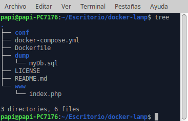
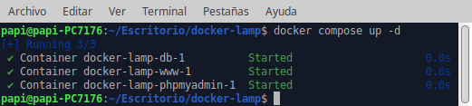
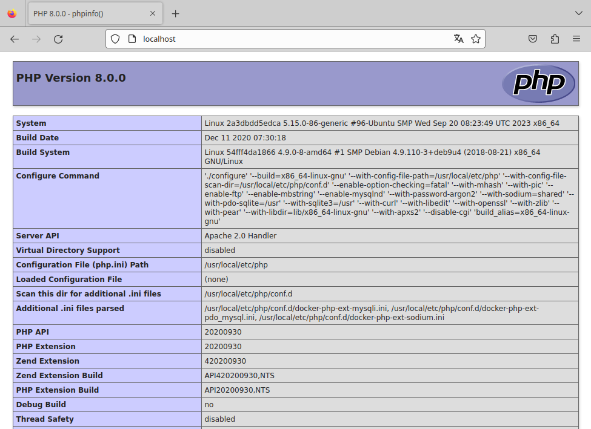
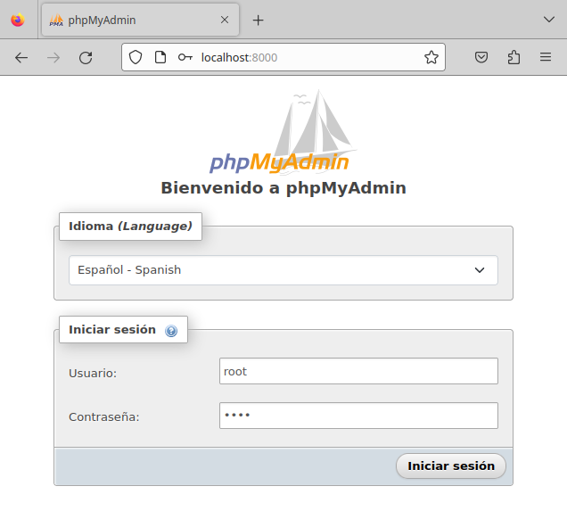
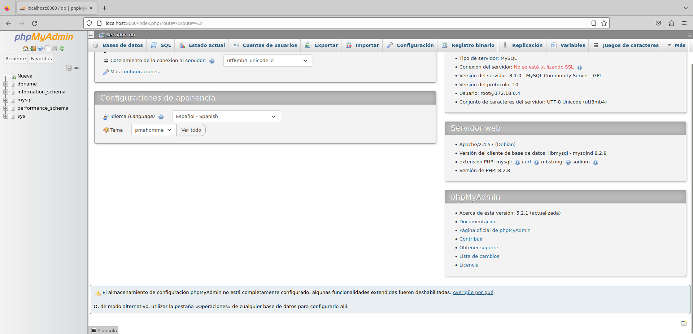

# LAMP con Docker  
***
Busca algún repositorio donde tengas disponible la descarga y despliegue de la infraestructura LAMP con docker-compose.  
Detalla el proceso realizado con capturas de pantalla incluyendo la prueba de que el/los contenedores están funcionando correctamente. Explica con tus palabras el contenido de los ficheros encargados del despliegue de la infraestructura (docker-compose.yml, Dockerfiles...)

**1. Clonación del repositorio**  
`git clone https://github.com/jersonmartinez/docker-lamp.git` para clonar el repositorio.  
Estructura:  
  
**2. Funcionamiento**  
- El proyecto requiere de un archivo Dockerfile, ya que el contenedor **www** se construirá a partir de dicho archivo.  
A partir de una imagen de php en la versión 8.0.0 con apache, junto con los drivers de conexión mysqli y pdo_mysql.  

  ```
  FROM php:8.0.0-apache

  ARG DEBIAN_FRONTEND=noninteractive

  RUN docker-php-ext-install mysqli \
      && docker-php-ext-install pdo \
      && docker-php-ext-install pdo_mysql

  RUN apt-get update \
      && apt install -y sendmail libpng-dev \
      && apt install -y libzip-dev \
      && apt install -y zlib1g-dev \
      && apt install -y libonig-dev \
      && rm -rf /var/lib/apt/lists/*

  RUN a2enmod rewrite
  ```
- Docker Compose a través del archivo docker-compose.yml permite orquestar la ejecución de los contenedores.  
  ```
  version: "3.1"
  services:
      db:
          image: mysql
          ports: 
              - "3306:3306"
          command: --default-authentication-plugin=mysql_native_password
          environment:
              MYSQL_DATABASE: dbname
              MYSQL_PASSWORD: test
              MYSQL_ROOT_PASSWORD: test 
          volumes:
              - ./dump:/docker-entrypoint-initdb.d
              - ./conf:/etc/mysql/conf.d
              - persistent:/var/lib/mysql
          networks:
              - default
      www:
          build: .
          ports: 
              - "80:80"
          volumes:
              - ./www:/var/www/html
          links:
              - db
          networks:
              - default
      phpmyadmin:
          image: phpmyadmin/phpmyadmin
          links: 
              - db:db
          ports:
              - 8000:80
          environment:
              MYSQL_USER: root
              MYSQL_PASSWORD: test
              MYSQL_ROOT_PASSWORD: test 
  volumes:
      persistent:
  ```
**db**  
- image: selecciona la imagen del mysql versión 8.0  
- ports: se expone el puerto 3306 en el puerto 3306 del anfitriión.  
- command: instrucción para habilitar la autenticación con la contraseña nativa de MySQL.  
- environment: variables de entorno referidas a la base de datos.
- volumes: sincronización entre ficheros, así como la configuración y donde corre el demonio de MySQL.  
- networks: define el nombre de la red por la cual estará conectados los contenedores, en este caso default.  

**www**  
- build: tiene como valor ., indicando que se construirá el contenedor mediante el archivo .Dockerfile.  
- ports: se expone el puerto 80 del contenedor en el puerto 80 del anfitrión.    
- volumes: se sincroniza la carpeta ./www del anfitrión con la carpeta /var/www/html del contenedor.  
- links: el contenedor podrá verse y compartir recursos en red con el contenedor de base de datos **db**.  
- networks: define el nombre de la red por la cual estará conectados los contenedores, en este caso default.  

**phpmyadmin**  
- image: selecciona la de phpmyadmin/phpmyadmin.  
- ports: se expone el puerto 80 del contenedor en el puerto 8000 del anfitrión.  
- links: se conecta con el contenedor **db** para tener acceso al sistema gestor de base de datos.  
- environment: el contenedor recibe 3 variables de entorno con el prefijo de MYSQL_ donde escribe el nombre de usuario, contraseña y contraseña de root.

**volumes**  
- persistent: todos los volúmenes se encuentran en modo persistente, por lo que no hay pérdida de datos y de enlace.  

**Página de inicio del Servidor Web**  
Este trozo de código php ubicado en www/index.php es para comprobar que el sitio carga bien e interpreta PHP:  
```
<?php
  phpinfo();
?>
```
**3. Puesta en marcha**  
`docker compose up -d` para lanzar la configuración.  
Como pueden observar en la imagen, se crean 3 contenedores con los prefijos docker-lamp (que es el directorio donde se encuentran), seguido del nombre del contenedor y el sufijo -1, con resultado **Started** si todo ha ido bien.  
  
**4. Conexión con el Servidor Web**  
Introducimos en el navegador web http://localhost y comprobamos que la página de inicio carga e interpreta PHP:  
  
**5. Conexión con PhpMyAdmin**  
Introducimos en el navegador web http://localhost:8000  
El usuario y la contraseña tal y como fueron definidos en el archivo .yml:
- Usuario: root  
- Contraseña: test  

  
  

