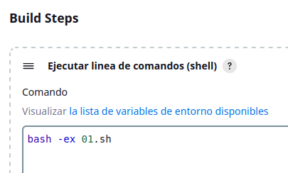

# JOB básico Jenkins    
***
Crear un job de Jenkins que se ejecute periódicamente (una vez al día) con las siguientes características:
- Debe rastrear los usuarios del sistema **en el que está instalada la instancia** de Jenkins.  
- En caso de detectar que se han creado nuevos usuarios (id>1005)  se debe notificar al administrador del sistema con un correo electrónico.  

Según la imagen oficial docker de [Jenkins](https://hub.docker.com/_/jenkins/), el método para levantar un contenedor con persistencia podría haber sido algo como:  
``docker run -p 8080:8080 -p 50000:50000 -v /home/papi/Escritorio/jenkins:/var/jenkins_home jenkins/jenkins:lts``, pero dado que desde el contenedor ha de acceder a nuestro archio /etc/passwd de la máquina anfitriona, el comando para crear un volumen compartiendo el archivo **/etc/passwd** con el archivo **/data/passwd** en modo sólo lectura sera:  
``docker run -p 8080:8080 -p 50000:50000 -v /home/papi/Escritorio/jenkins:/var/jenkins_home -v /etc/passwd:/data/passwd:ro jenkins/jenkins:lts``  
**1. Disparador para que ejecute cada día, por ejemplo a las 10**  
  
**2. Step para ejecutar linea de comandos (shell)**  
Con ``bash -ex 01.sh`` estamos diciendo que se ejecute el script 01.sh (ubicado en el workspace), auque en su lugar podríamos haber puesto directamente su contenido:
```
while IFS=: read -r username password uid gid info home shell; do
    if [ "$uid" -gt 1005 ] && [ "$uid" -lt 64055 ]; then
        exit 1
    fi
done < /data/passwd
exit 0
```
  
**3. Enviar correo al administrador en caso de que una ejecución falle (exit 1 por parte del script)**
    
**4. Comprobación**  
- Email recibido  
  
- Salida de consola  
  