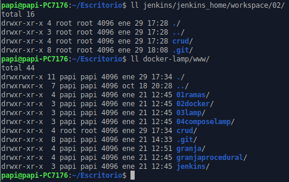

# Freestyle job - despliegue web/git  
***
Crear un job de Jenkins que descargue el código de un proyecto web alojado en tu repositorio de github.  
El job debe contactar con el repositorio y descargarse el proyecto web **(se hace automáticamente)**.  
Una vez descargado se debe **copiar** el proyecto web en la carpeta www de tu servidor Apache de prácticas anteriores.  
Documentar gráficamente los pasos seguidos, así como detallar brevemente los pasos  y problemas encontrados.  

docker-compose.yml para conectar carpetas mediante volúmenes:
```
version: "3"

services:
  jenkins:
    # El usuario jenkins no tiene permiso para copiar
    user: root
    image: jenkins/jenkins:lts
    container_name: jenkins
    ports:
      - "8080:8080"
    volumes:
      # Persistencia
      - ./jenkins_home:/var/jenkins_home
      # Para poder leer el archivo /etc/passwd del anfitrión
      - /etc/passwd:/data/passwd:ro
      # Para poder copiar en la carpeta ../docker-lamp/www de prácticas anteriores
      - ../docker-lamp/www:/www
      #- /usr/local/bin/docker:/usr/bin/docker
      #- /var/run/docker.sock:/var/run/docker.sock
    networks:
      - mynet
    
networks:
  mynet:
    driver: bridge
```  
Creamos el job **02** de tipo estilo libre.  
1. Configuramos el origen del código fuente **Git**  
  
2. Introducimos la URL de nuestro repositorio (dado que el acceso es libre no introducimos credenciales).  
  
3. Comprobamos que la rama del repositorio es correcta.  
  
4. Añadimos un Build Step de tipo Ejecutar linea de comandos (shell) e introducimos el código para copiar el repositorio descargado a la carpeta www del servidor Apache.   
  
5. Tras guardar el job y ponerlo en marcha podemos comprobar que la carpeta crud del repositorio se descargó al workspace 02 y se copió en la carpeta www del servidor Apache.  
  