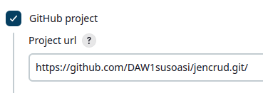

# Despliegue web/git mediante Pipelines  
***
Crear un Pipeline de Jenkins que descargue el código de un proyecto web alojado en tu repositorio de github.  
El job debe contactar con el repositorio y descargarse el proyecto web **(se hace automáticamente)**.  
Una vez descargado se debe **copiar** el proyecto web en la carpeta www de tu servidor Apache de prácticas anteriores.
Después debe mandar una notificación mediante Telegram.  
Documentar gráficamente los pasos seguidos, así como detallar brevemente los pasos  y problemas encontrados.  

1. Esta vez hemos hecho las cosas mejor y hemos creado un repositorio con una sola carpeta con nuestro crud.  
2. Lo suyo hubiera sido ayudarnos del plugin Blue Oceans para crear gráficamente los stages del Pipeline; lo malo es que nos crea un multibranch (menos al profe), y ésto no nos vale.  
Por lo tanto tendremos que crear y editar un archivo Jenkinsfile desde nuestro repositorio, o lo podemos crear y editar en local y después hacer push hacia el repositorio.  
El contenido de dicho archivo que hace todos los stages es el siguiente:  
    ```
    pipeline {
      agent any
      stages {
        stage('copiar') {
          steps {
            sh '''echo "copiando";
            cp -r ./crud /www;'''
            sh 'ls'
          }
        }
      }
      post {
        success {
          sh 'curl -X POST -H "Content-Type: application/json" -d "{\\"chat_id\\": \\"6644496010\\", \\"text\\": \\"Tarea $JOB_NAME OK!! $BUILD_NUMBER,  \\", \\"disable_notification\\": false}" https://api.telegram.org/bot6910914256:AAGPbsMpEj2dEexG8GqgQf_peUSZNBN_O8g/sendMessage'
          // emailext(subject: 'Jenkins', body: 'Tarea OK', attachLog: true, to: 'suso2asi@gmail.com')
        }
        failure {
          sh 'curl -X POST -H "Content-Type: application/json" -d "{\\"chat_id\\": \\"6644496010\\", \\"text\\": \\"Falló la tarea $JOB_NAME!! $BUILD_NUMBER,  \\", \\"disable_notification\\": false}" https://api.telegram.org/bot6910914256:AAGPbsMpEj2dEexG8GqgQf_peUSZNBN_O8g/sendMessage'
          // emailext(subject: 'Jenkins', body: 'Tarea fallida', attachLog: true, to: 'suso2asi@gmail.com')
        }
      }
    }
    ```  
    6644496010 es nuestro **ID** de Telegram (se obtiene introduciendo ```userinfobot``` en el cuadro de búsqueda), y 6910914256:AAGPbsMpEj2dEexG8GqgQf_peUSZNBN_O8g es el **TOKEN** que nos han proporcionado al crear el bot.  
3. Levantamos el chiringuito con un ```docker-compose up -d``` de nuestro docker-compose.yml anterior que tenía el siguiente contenido:  
    ```
    version: "3"

    services:
      jenkins:
        # El usuario jenkins no tiene permiso para copiar
        user: root
        image: jenkins/jenkins:lts
        container_name: jenkins
        ports:
          - "8080:8080"
        volumes:
          # Para la persistencia
          - ./jenkins_home:/var/jenkins_home
          # Para poder copiar en la carpeta ../docker-lamp/www de prácticas anteriores
          - ../docker-lamp/www:/www
        networks:
          - mynet
        
    networks:
      mynet:
        driver: bridge
    ```  
4. Creamos una nueva tarea de tipo Pipeline con las siguientes características:  
    - Es un proyecto **GitHub**, por lo que introducimos la URL:  
      
    - El script (archivo **Jenkinsfile**) está en la rama main de nuestro respositorio:  
      
5. Tras arrancar la tarea:  
    - Debemos recibir una notificación vía Telegram tanto de si el resultado ha sido exitoso como fallido:  
      
    - Comprobamos que la carpeta crud del repositorio se descargó al workspace 03 y se copió en la carpeta www del servidor Apache.  
      


