# Creación de nodos (agents)  
***
- Nodo conectado via Java Web Start (JNLP) (Agent.jar)  
- Nodo en máquina EC2 de AWS (SSH)  
Detalla los pasos seguidos con capturas de pantalla y muestra que el nodo se ha conectado y que ejecuta correctamente alguna tarea.  

Antes no lo necesitábamos, pero para esta práctica sí vamos a necesitar acceder al puerto 50000 por defecto para el nodo, por lo que levantaremos el chiringuito con el siguiente docker-compose.yml:  
```
version: "3"

services:
jenkins:
    user: root
    image: jenkins/jenkins:lts
    container_name: jenkins
    ports:
    - "8080:8080"
    # Puerto necesario para el nodo
    - "50000:50000"
    volumes:
    # Para la persistencia
    - ./jenkins_home:/var/jenkins_home
    networks:
    - mynet
    
networks:
mynet:
    driver: bridge
```
**Importante:** Necesitamos javo 8 o java 11 instalado **en los nodos**  
Comprobamos si lo tenemos instalado con ```java -version```  
Si no lo tenemos instalado, en un sistema Unix instalamos la versión 11 con ```apt install openjdk-11-jdk```
1. Vamos a crear un nodo en nuestra red local conectado mediante Java Web Start (JNLP) (Agent.jar)  
    - Administrar Jenkins -> Nodes -> New Node  
    Le damos un nombre y de tipo permanente  
    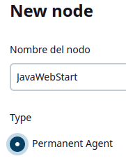  
    Lo configuramos tal que así y el resto por defecto  
    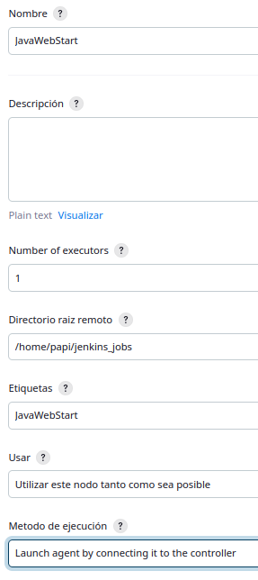  
    - Ya tenemos creado el nodo, ahora para configurar la conexión hacemos click sobre el nombre  
    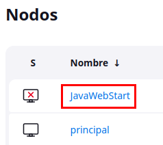  
    Dado que el nodo está basado en Unix, éste es el código que deberemos ejecutar en el nodo  
    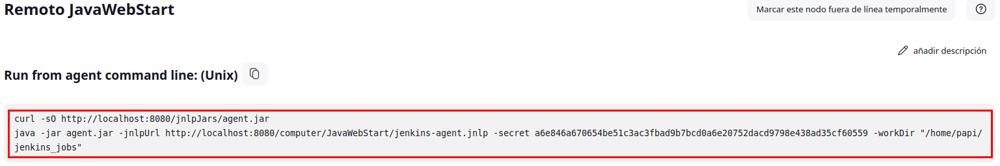  
    Salida de la ejecución del código en el nodo  
    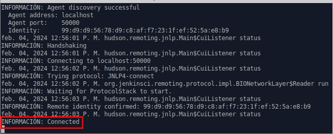  
    El nodo ya no aparece en rojo  
    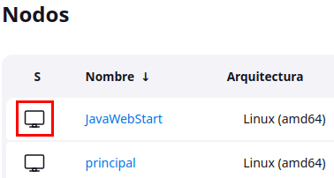  
    - Ahora que ya tenemos el nodo y está conectado podemos asignarle un job facilito de estilo libre que cree el archivo job04.txt en su workspace y contenido "Job 04 exitoso"  
    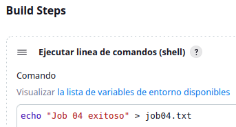  
    Importante indicar que la tarea se ejecutará en el nodo  
    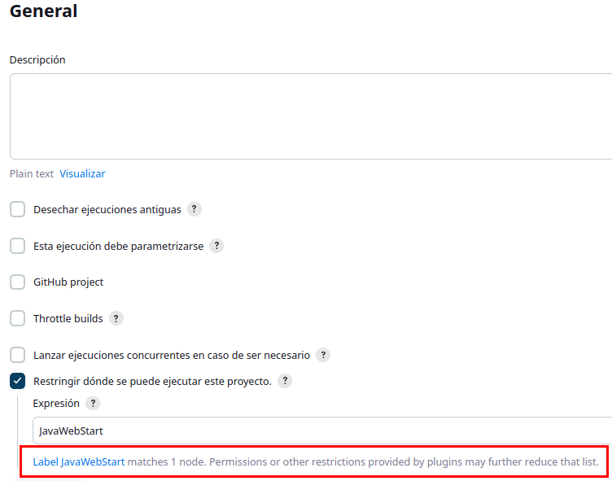  
    - Tras la ejecución del job 04 podemos comprobar que en el nodo se han creado las carpetas workspace y el nombre del job, junto con el archivo job04.txt con contenido "Job 04 exitoso"  
    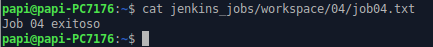  
      
2. Vamos a crear un nodo en máquina EC2 de AWS conectado mediante SSH  
    **Si no localizamos el archivo .pem que nos descargamos al crear la instancia en AWS no podremos usarlo como credenciales, por lo que tendremos que seguir los siguientes pasos:**  
    - Con el usuario ubuntu generamos un certificado/clave SSH con ```ssh-keygen```  
    - Añadimos el contenido de ~/.ssh/id_rsa.pub al archivo ~/.ssh/authorized_keys con ```cat ~/.ssh/id_rsa.pub | sudo tee -a ~/.ssh/authorized_keys```  
    - Copiamos la salida de la clave privada ```cat ~/.ssh/id_rsa``` ya que lo necesitaremos cuando configuremos las nuevas credenciales que crearemos en el paso siguiente   
    - Administrar Jenkins -> Credencials -> System -> Global credentials (unrestricted) -> Add Credentials  
    Las configuraremos así pegando la clave privada copiada anteriormente  
    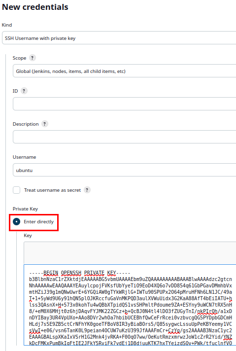  
    - Administrar Jenkins -> Nodes -> New Node  
    Le damos un nombre y de tipo permanente  
    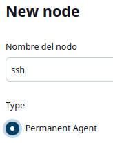  
    Lo configuramos tal que así seleccionando en credentials las anteriormente creadas, y el resto por defecto  
    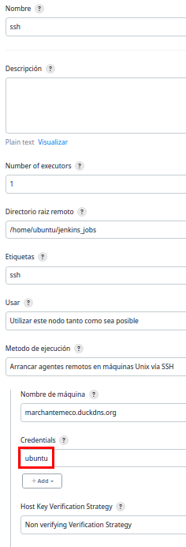  
    Launch agent para iniciar la conexión  
    Salida de los logs  
    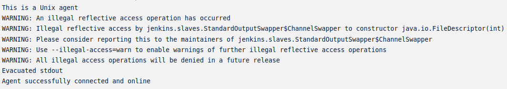  
    El nodo ya no aparece en rojo  
    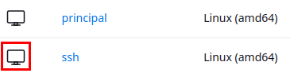  
    - Ahora que ya tenemos el nodo y está conectado podemos asignarle un job facilito de estilo libre que cree el archivo job05.txt en su workspace y contenido "Job 05 exitoso"  
    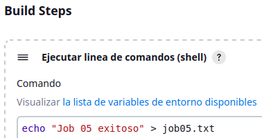  
    Importante indicar que la tarea se ejecutará en el nodo  
    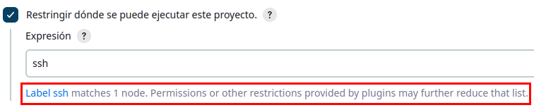  
    - Tras la ejecución del job 05 podemos comprobar que en el nodo se han creado las carpetas workspace y el nombre del job, junto con el archivo job04.txt con contenido "Job 05 exitoso"  
    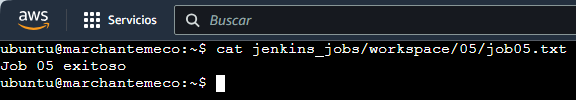  
      