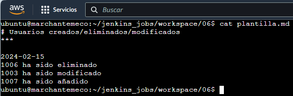

# Tarea final  
***
Automatiza el siguiente proceso utilizando un pipeline de Jenkins ejecutado en un nodo externo (AWS o docker local)  
1. En un repositorio creado por vosotros encontramos dos ficheros excel (old.xslx y new.xslx con usuarios) y plantilla.md que deben ser descargados.   
2. Se debe comparar línea a línea mediante el script python python-diff.py el fichero que representa la nueva versión de los usuarios (new.xslx) con la versión anterior (old.xsls), y se almacenarán los cambios observados (usuarios nuevos, eliminados y modifcados) en el fichero meta-script.sh para poder utilizarlo en el siguiente paso.  
    - Notificar por Telegram al administrador si ha ido bien este paso.  
3. Se debe ejecutar por ssh en un servidor (o máquina conocida diferente al nodo donde se ejecuta el pipeline) el script meta-script.sh para la inserción/modificación/eliminación de los usuarios.  
    - Notificar por Telegram al administrador si ha ido bien este paso.  
4. Crear un informe a partir de plantilla.md en el que se reflejarán los cambios realizados (usuarios insertados / eliminados / modificados).  
5. Push al github añadiendo el informe a una carpeta de informes del repositorio
Notificaciones:  
    - Si todo ha ido bien se envía un correo electrónico (con el servidor que os habéis montado en otro módulo del ciclo) al administrador con el pdf del informe Markdown (utilizar Pandoc)
    - Si el proceso ha fallado se debe enviar una notificación al administrador con el log de la ejecución.  

    Bola Extra: Notificaciones a los usuarios por correo electrónico:  
    - Usuarios añadidos: "Usuario añadido al sistema! Tus credenciales de acceso son: ...."
    - Usuarios eliminados: "Se ha dado de baja del sistema"
    - Usuarios modificados: "Su perfil ha sido actualizado"

Si la dirección de correo electrónico de los usuarios hubuese sido corporativa en vez de inventada, no hubiese habido problema para implementar la bola extra mediante python.  
El nodo ha de ser la máquina EC2 de AWS que dispone de servidor electrónico, y que casualmente es la máquina AWS(SSH) de la anterior tarea.  
Aprovecho que en dicha tarea creé en el nodo el par de claves mediante ```ssh-keygen```, para ahora conectar mediante ssh con el servidor (**marchante.ddns.net**), por lo que añado al archivo ```authorized-keys``` del servidor la clave pública ```.ssh/id_rsa.pub``` del nodo.  
Instalamos pandoc en el nodo para pasar la plantilla Markdown a pdf con ```sudo apt install pandoc texlive-latex-base```.  
Mediante mail y sendmail no he conseguido adjuntar un archivo al enviar un correo electrónico, al contrario que con mutt, por lo que instalamos la aplicación en el nodo con ```sudo apt install mutt```.  
El script python es ~/python-diff.py  
Para hacer push al repositorio debemos crear un token en github en Settings -> Developer settings -> Personal access tokens -> Tokens (classic) y lo copiamos; ahora en Jenkins creamos una nueva credencial en Administrar Jenkins -> Credentials -> System -> Global credentials (unrestricted) -> Add credentials (Username es nuestro nombre de usuario github, en Password pegamos el token que copiamos anteriormente, ID es el credentialsId que usaremos luego al hacer push, por ejemplo 'patata').  
  
Esta es la configuración inicial de usuarios en el servidor:  
  
Levantamos el chiringuito con el siguiente docker-compose.yml:  
```
version: "3"

services:
  jenkins:
    user: root
    image: jenkins/jenkins:lts
    container_name: jenkins
    ports:
      - "8080:8080"
      # Puerto necesario para el nodo
      - "50000:50000"
    volumes:
      - ./jenkins_home:/var/jenkins_home
    networks:
      - mynet
networks:
  mynet:
    driver: bridge
```
No sé si es normal, pero en mi caso para que el Pipeline se ejecute en el nodo he tenido que configurar el nodo **"principal"** para que se ejecute **sólo en tareas viculadas a él.**  
  
En el anterior ejercicio creamos una tarea de estilo libre para ejecutarse en el nodo; esta vez crearemos una tarea Pipeline y la configuraremos para que se ejecute en el nodo tal que así:  
  
  
El nodo es el siguiente (es el mismo que el de la anterior tarea SSH pero con otro nombre debido a las pruebas):  
  
En github deberemos tener la plantilla en Markdown, los 2 archivos xlsx y lo más importante, el archivo Jenkinsfile con el siguiente contenido:  
```
pipeline {
  agent any
  stages {
    stage('Descargar repositorio') {
      steps {
        sh 'echo "Descargando de repositorio"'
      }
    }
    stage('Ejecutar scritp python') {
      steps {
        sh '~/python-diff.py ./old.xlsx ./new.xlsx'
      }
    }
    stage('Enviar Telegram python OK') {
      steps {
        sh 'curl -X POST -H \'Content-Type: application/json\' -d \'{"chat_id": "6644496010", "text": "Python OK!!!", "disable_notification": false}\'  https://api.telegram.org/bot6910914256:AAGPbsMpEj2dEexG8GqgQf_peUSZNBN_O8g/sendMessage'
      }
    }
    stage('Ejecutar script bash en el servidor') {
      steps {
	    sh 'chmod +x meta-script.sh'
        sh 'ssh ubuntu@marchante.ddns.net "sudo bash -s" < meta-script.sh'
      }
    }
    stage('Enviar Telegram bash OK') {
      steps {
         sh 'curl -X POST -H \'Content-Type: application/json\' -d \'{"chat_id": "6644496010", "text": "Bash OK!!!", "disable_notification": false}\'  https://api.telegram.org/bot6910914256:AAGPbsMpEj2dEexG8GqgQf_peUSZNBN_O8g/sendMessage'
      }
    }
	  stage('Crear informe en pdf') {
      steps {
        sh 'pandoc plantilla.md -o informe.pdf'
      }
    }
    stage('Hacer push a GitHub') {
      steps {
        sh 'git pull origin main'
        sh 'git add informe.pdf'
        sh 'git commit -m "Añadir informe.pdf"'
        withCredentials([gitUsernamePassword(credentialsId: 'patata', gitToolName: 'Default')]) {
          sh "git push origin HEAD:main"
        }
      }
    }
  }
  post {
    success {
      script {
	    def cuerpoCorreo = "Tarea OK"
	    def destinatario = "papi@marchantemeco.duckdns.org"
	    def archivoAdjunto = "/home/ubuntu/jenkins_jobs/workspace/06/informe.pdf"
	    def asuntoCorreo = "Envío de informe tarea"
	    sh "echo \"${cuerpoCorreo}\" | mutt -s \"${asuntoCorreo}\" -a ${archivoAdjunto} -- ${destinatario}"
	  }
    }
    failure {
        script {
	      def cuerpoCorreo = "Tarea falló pero no conseguí obtener los logs"
	      def destinatario = "papi@marchantemeco.duckdns.org"
	      def asuntoCorreo = "Envío de logs tarea"
	      sh "echo \"${cuerpoCorreo}\" | mutt -s \"${asuntoCorreo}\" -- ${destinatario}"
	  }
    }
  }
}
```  
Tras la ejecución de la tarea 06 vamos a ver qué ha pasado paso por paso:  
- El repositorio ha sido descargado  
  
- Se ejecuta el script python con éxito y se envía una notificación vía Telegram  

Por consola ya nos muestra que en el paso siguiente cuando se ejecute el script bash en el servidor se modificará el usuario 1003, se eliminará el usuario 1006 y se creará el usuario 1007; ésto se ha debido reflejar en la plantilla.md  
  
- Se convierte en ejecutable el script bash, se ejecuta con éxito en el servidor y se envía una notificación vía Telegram  
  
Verificamos que el script es ejecutable   
  
Comprobamos los cambios de los usuarios tras la ejecución  
  
- Mediante pandoc se exporta plantilla.md a informe.pdf  
  
- Se sube informe.pdf a github  
  
  
- Y por último se envía al administrador el informe como archivo adjunto  
  
El correo ha sido recibido con el informe adjunto  
  
- Notificaciones recibidas por Telegram  
  