# Trabajando con ramas por parejas
***
1. Crear un repositorio.
- asirpapa crea el repositorio "colaborativo" en github:
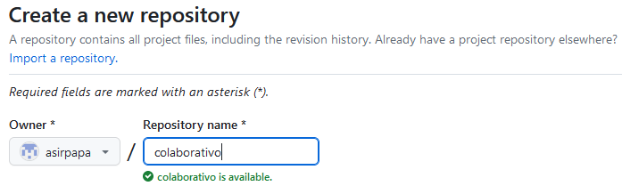
- asirpapa invita a colaborar en el proyecto a DAW1susoasi:
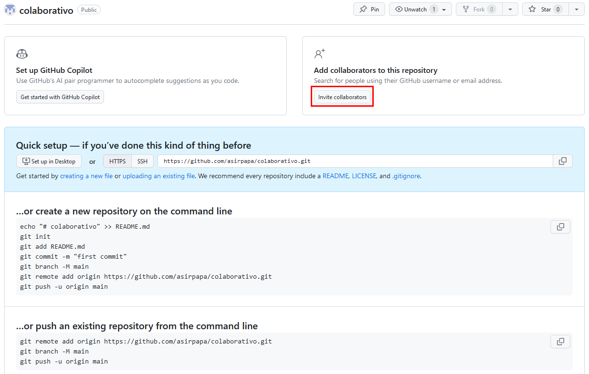
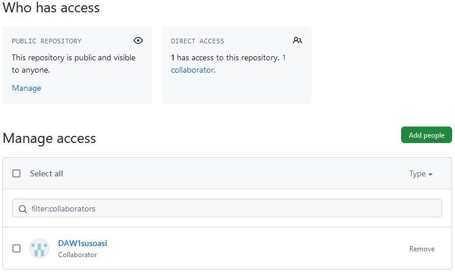
***
2. Trabajar por parejas sobre este repositorio creando ramas y haciendo commits sobre el mismo fichero generando que aparezca un conflicto.
- asirpapa clona el repositorio en local:
`$ git clone` <https://github.com/asirpapa/colaborativo.git>
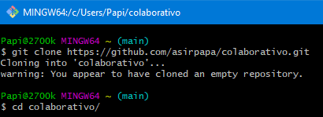
- asirpapa añade los archivos index.html y styles.css: hjhijhiuhiuhiuhiuhui 
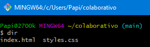
- asirpapa añade los nuevos archivos al repositorio local y los sincroniza con el repositorio remoto:
```bash
$ git add .
$ git commit -m "Nuevos archivos web"
$ git push
```
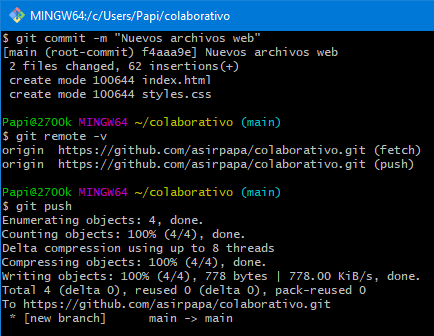
- DAW1susoasi clona el repositorio con los archivos web iniciales sobre los que luego cada uno creará su rama y modificará lo que tenga que modificar:
`$ git clone` <https://github.com/asirpapa/colaborativo.git>
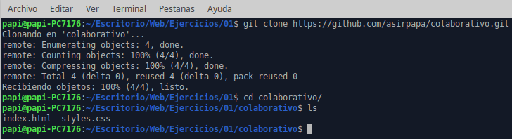
- DAW1susoasi crea su rama para trabajar con ella:
```bash
$ git branch suso
$ git remote -v
$ git push origin suso:suso (la rama en GitHub no existe pero nos la crea)
```
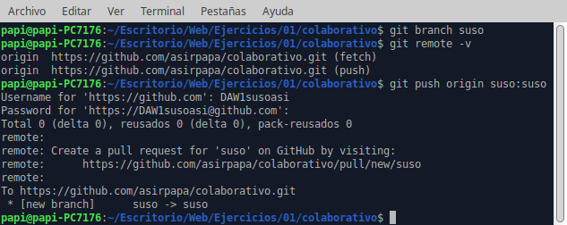

- asirpapa crea su rama para trabajar con ella:
```bash
$ git branch papa
$ git remote -v
$ git push origin papa:papa (la rama en GitHub no existe pero nos la crea)
```
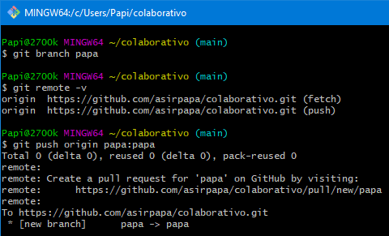
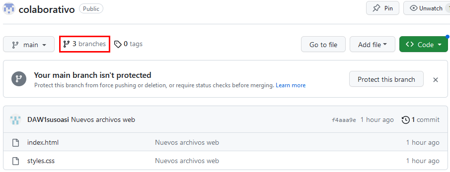
- asirpapa modifica la línea 3 del archivo styles.css en su rama, hace un merge con la la rama principal, lo sube a github y finalmente elimina la rama tanto local como remota.
```bash
$ git checkout papa
$ git add .
$ git commit -m "modificado systes.css"
$ git push origin papa:papa
```
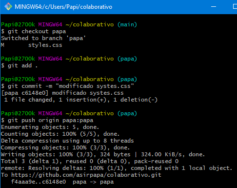
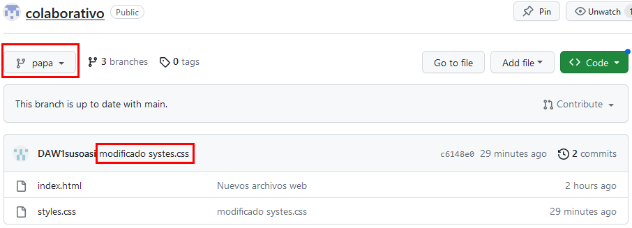
```bash
$ git checkout main
$ git merge papa
$ git push
```
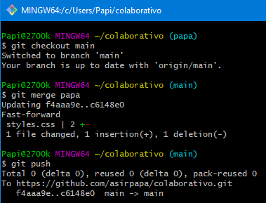
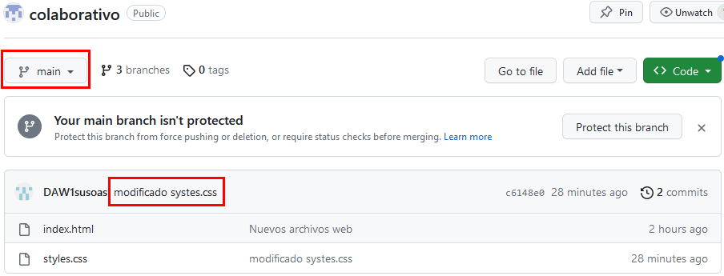
```bash
$ git branch -d papa
$ git branch
```
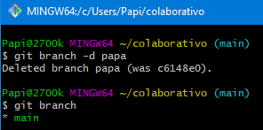
```bash
$ git push origin --delete papa
```
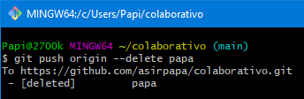
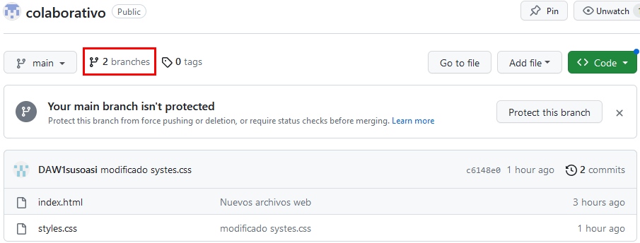
- DAW1susoasi modifica la línea 3 del archivo styles.css en su rama, hace un merge con la la rama principal (**sin hacer previamente pull en la rama principal para actualizarla**) y lo sube a github:
```bash
$ git checkout suso
$ git add .
$ git commit -m "modificado styles.css"
$ git push origin suso:suso
```
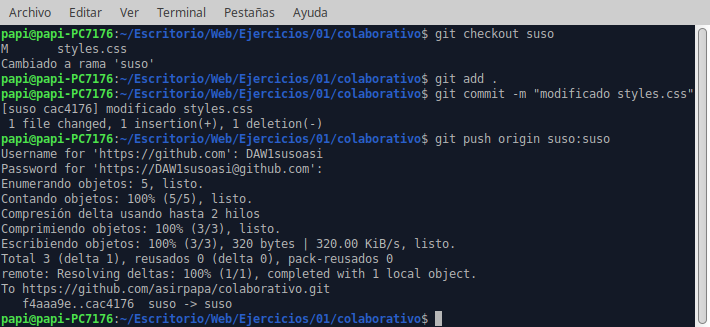
```bash
$ git checkout main
$ git merge suso
$ git push
```
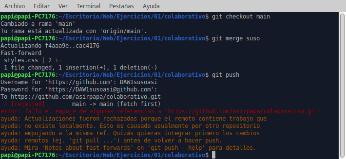
***
3. Gestión y resolución del conflicto.
- DAW1susoasi que fue quien tuvo el problema lo soluciona con:
```bash
$ git pull
$ git config pull.rebase false
$ git pull
$ git add .
$ git commit -m "solucion conflicto"
$ git push
$ git status
```
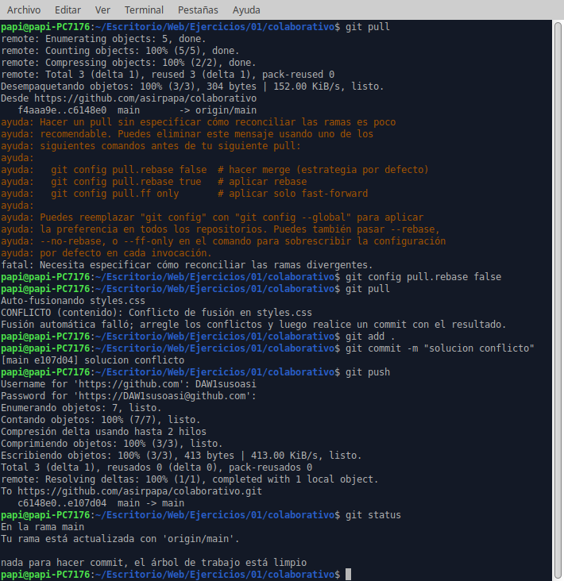
- DAW1susoasi finalmente elimina la rama tanto local como remota:
```bash
$ git branch -d suso
$ git branch
$ git push origin --delete suso
```
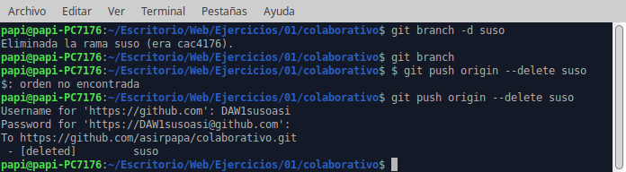
***
4. Mostrar cómo aparece el historial de commits con las fechas y los autores, tanto desde consola como desde github.
```bash
$ git log
```
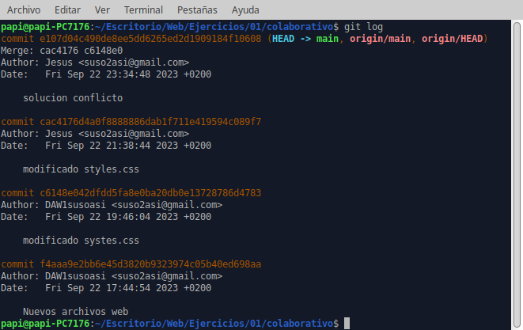
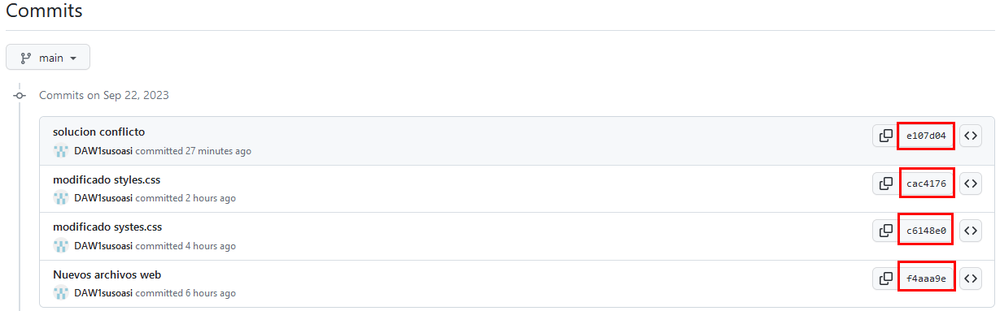
Moraleja: antes de que se produzca el error (antes de hacer merge) hay que hacer **pull** en la rama principal del repositorio local para que se actualice (internamente hace un merge del repositorio local con el remoto).